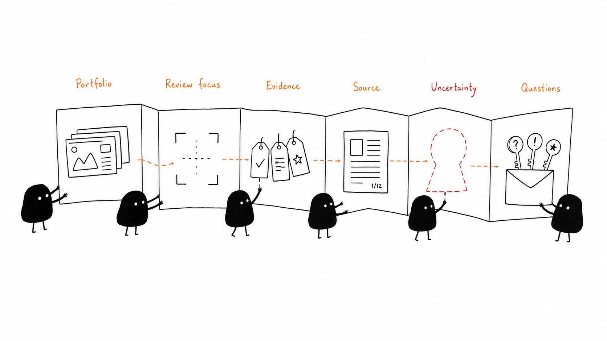

# Pheet

Pheet (pronounced _fit_) is an evidence-led capability-alignment workspace. It
maps demonstrated portfolio work to a focused capability lens, preserves exact
source provenance, makes uncertainty visible, and turns that uncertainty into
grounded interview questions.

> Evidence, not a verdict. Pheet does not score or rank candidates, infer
> overall ability, or make hiring decisions.



## First deterministic vertical slice

The implemented journey lets a hiring manager:

1. Start the prepared review in one action, loading the portfolio and prepared
   demonstration lens atomically.
2. Run a deterministic alignment and see all findings grouped by capability.
3. Filter uncertainty and inspect a finding beside its exact prepared source
   section. A `not_observed` finding records the sections reviewed instead of
   pretending an absence is a source quote.
4. Review evidence gaps and the qualitatively most uncertain capability.
5. Generate up to three questions grounded only in selected gap IDs, then
   accept, edit, or dismiss each question.

The same serialized command controller powers UI actions and six progressively
exposed WebMCP tools:

- `start_demo_review`
- `analyze_evidence`
- `query_evidence`
- `inspect_evidence`
- `identify_gaps`
- `prepare_interview_questions`

Tool outputs are bounded, portfolio text is marked as untrusted content, and
each request is visible in the in-memory activity strip as a human or agent
action. Unsupported browsers retain the complete manual journey. Refreshing
always starts a clean workspace.

## Run locally

Requirements: Node.js 20.9 or newer and npm.

```bash
npm install
npm run dev
```

Open [http://localhost:3000](http://localhost:3000). The prepared journey uses
no model, database, authentication, or network import service.

For Chrome’s current WebMCP origin trial, copy `.env.example` to `.env.local`
and set `WEBMCP_ORIGIN_TRIAL_TOKEN` to the token issued for your origin. Without
it—or in a browser without `document.modelContext`—Pheet clearly enters manual
mode.

## Verify

```bash
npm run format
npm run lint
npm run typecheck
npm test
npm run build
npx playwright install chromium
npm run test:browser
```

The Vitest suite covers schema and cross-reference integrity, all evidence
states, shared commands, failure paths, the full manual journey, and staged
WebMCP registration. Playwright covers the production journey, clean refresh,
keyboard focus, and a 390px viewport.

## Architecture

The data boundaries are deliberate:

- `sourceDocuments`: prepared, untrusted portfolio sections.
- `graph`: portfolio, project, claim, artifact, and source-reference extraction.
- `lens`: the prepared capability definitions and observable signals.
- `alignment`: deterministic evidence, gap, and question records.
- `commands`: the only state-changing application boundary used by both humans
  and WebMCP tools.

Zod validates every boundary and all cross-references before a workspace can be
loaded. The canonical fixture exercises demonstrated, partially demonstrated,
claimed-but-unsupported, and not-observed evidence.

## Product build plan

The first slice is complete. The intended end-to-end product sequence is:

1. **Deterministic foundation — complete.** Prepared fixture, evidence map,
   source inspection, uncertainty, grounded questions, shared actions, WebMCP,
   accessibility states, and automated verification.
2. **Evaluation harness.** Freeze golden portfolios and lenses, add provenance
   precision/recall checks, question-grounding checks, accessibility audits,
   and adversarial prompt-injection fixtures before introducing models.
3. **Reviewable import.** Add public-URL retrieval behind a feature flag, SSRF
   protections, size/time/type limits, sanitized extraction, and an explicit
   human review-and-accept step. Retrieval, extraction, and alignment remain
   separate. This is deliberately not implemented in the first slice.
4. **Model-assisted extraction and alignment.** Use schema-constrained outputs,
   source spans, deterministic fallbacks, cost/latency budgets, and evaluation
   gates. Never let model output mutate source documents.
5. **Saved private workspaces.** Add authentication, tenancy, encrypted
   persistence, audit retention, deletion/export controls, and role-based
   sharing only after the transient workflow is trustworthy.
6. **Team workflow.** Lens authoring, question collaboration, reviewer notes,
   and exportable interview briefs—without candidate comparison or composite
   scores.
7. **Operational scale.** Observability, rate limits, abuse controls, background
   jobs, regional/privacy requirements, incident playbooks, and measured rollout.

## Journey illustrations

The seven Ian Xiaohei illustrations in `assets/pheet-journey-illustrations/`
cover discovery, review start, evidence mapping, source tracing, uncertainty,
and grounded interview results. Browser-ready copies live in `public/journey/`.

## Documentation

- [`AGENTS.md`](AGENTS.md): durable implementation constraints
- [`docs/PRODUCT.md`](docs/PRODUCT.md): product specification
- [`docs/ARCHITECTURE.md`](docs/ARCHITECTURE.md): technical architecture
- [`docs/IMPLEMENTATION_PLAN.md`](docs/IMPLEMENTATION_PLAN.md): delivery plan
- [`docs/WEBMCP_RESEARCH.md`](docs/WEBMCP_RESEARCH.md): platform research
- [`docs/DECISIONS.md`](docs/DECISIONS.md): decision log
- [`docs/EVALUATION.md`](docs/EVALUATION.md): golden and live-origin evaluation
- [`docs/CHALLENGE_SUBMISSION.md`](docs/CHALLENGE_SUBMISSION.md): judge path and demo script

## Stack

Next.js, React, TypeScript, Zod, Vitest, Testing Library, Playwright, and GitHub
Actions.

## License

[MIT](LICENSE)
