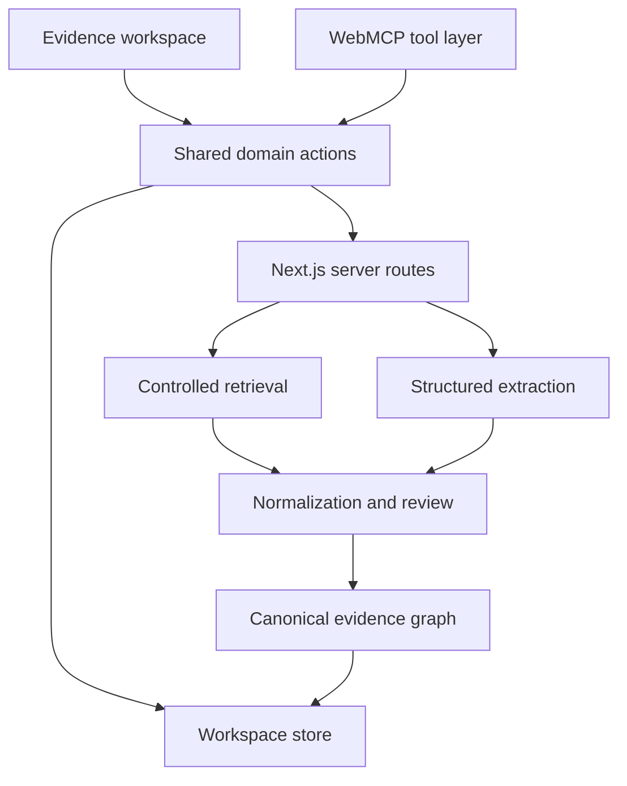

# Pheet technical architecture

Status: proposed MVP architecture  
Date: 2026-08-27

## 1. Architectural objective

Pheet must support one trustworthy end-to-end journey through two control
surfaces: the human interface and WebMCP. Both surfaces operate the same
domain actions and workspace state. The prepared demonstration must remain
fully usable when WebMCP, crawling, or model-backed extraction is unavailable.

```text
Human interface ──┐
                  ├── Shared domain actions ── Workspace state
WebMCP tools ─────┘
```

## 2. System boundary

### Inside the MVP

- Next.js web application.
- Client-side evidence workspace.
- Canonical Zod schemas and deterministic domain actions.
- Prepared portfolio fixture.
- Browser-local session persistence.
- Lifecycle-managed WebMCP tool registration.
- Optional server routes for controlled import and structured extraction.
- Evaluation fixtures and browser-level tests.

### Outside the MVP

- User accounts and organization tenancy.
- Persistent candidate records.
- Applicant-tracking systems.
- Payments and entitlements.
- Automated employment recommendations.
- General-purpose crawling.
- Background job infrastructure unless live import demonstrably requires it.

## 3. Recommended repository structure

```text
app/
├── api/
│   ├── import/route.ts
│   └── extract/route.ts
├── globals.css
├── layout.tsx
└── page.tsx
components/
├── start/
├── workspace/
├── evidence/
├── sources/
├── interview/
└── webmcp/
domain/
├── schemas/
├── actions/
├── selectors/
├── rules/
└── errors.ts
fixtures/
├── demo-portfolio.json
└── demo-lens.ts
lib/
├── import/
├── extraction/
├── webmcp/
└── analytics/
tests/
├── unit/
├── integration/
├── e2e/
└── evals/
docs/
```

The exact structure may evolve, but domain logic must not be embedded in UI
components or duplicated inside WebMCP handlers.

## 4. Runtime architecture



### Client responsibilities

- Render all usable screens and states.
- Load and validate the prepared fixture.
- Hold the current workspace session.
- Execute deterministic domain actions.
- Register state-appropriate WebMCP tools.
- Show activity and resulting state changes.
- Preserve a useful fallback when WebMCP is unsupported.

### Server responsibilities

- Validate public URLs and reject unsupported schemes or private-network targets.
- Keep retrieval and model credentials server-side.
- Retrieve only user-approved public pages.
- Return bounded normalized candidates, not unbounded source dumps.
- Revalidate extraction inputs and outputs.
- Isolate external failures from the prepared workspace.

## 5. Canonical data model

```text
Portfolio
└── Project[]
    ├── Claim[]
    ├── ArtifactReference[]
    └── SourceReference[]

CapabilityLens
└── Capability[]

Portfolio + CapabilityLens
└── Analysis
    ├── EvidenceItem[]
    ├── EvidenceGap[]
    └── InterviewQuestion[]
```

### Workspace

Required fields:

```ts
type Workspace = {
  id: string;
  state:
    | "empty"
    | "portfolio_ready"
    | "lens_ready"
    | "analyzing"
    | "evidence_ready"
    | "preparing_questions"
    | "brief_ready";
  portfolioId?: string;
  lensId?: string;
  analysisId?: string;
  selectedEvidenceId?: string;
  activeQuery: EvidenceQuery;
  recentActivity: ToolActivity[];
  createdAt: string;
  updatedAt: string;
};
```

### Portfolio graph

```ts
type Portfolio = {
  id: string;
  ownerLabel: string;
  sourceUrl?: string;
  ingestionState: "prepared" | "retrieving" | "awaiting_review" | "accepted" | "failed";
  projectIds: string[];
};

type Project = {
  id: string;
  title: string;
  summary: string;
  roleClaim?: string;
  claimIds: string[];
  artifactRefs: string[];
  sourceRefs: string[];
};

type Claim = {
  id: string;
  projectId: string;
  text: string;
  claimType: "responsibility" | "decision" | "outcome" | "collaboration";
  sourceRefs: string[];
};

type SourceReference = {
  id: string;
  url: string;
  pageTitle: string;
  locator: string;
  excerpt?: string;
  retrievedAt?: string;
  trust: "prepared" | "public_unreviewed" | "user_reviewed";
};
```

### Capability model

```ts
type CapabilityLens = {
  id: string;
  label: string;
  context: string;
  capabilities: Capability[];
};

type Capability = {
  id: string;
  label: string;
  definition: string;
  priority: "primary" | "supporting";
  observableSignals: string[];
};
```

### Analysis model

```ts
type EvidenceState =
  | "demonstrated"
  | "partially_demonstrated"
  | "claimed_unsupported"
  | "not_observed";

type Relevance =
  | "direct"
  | "transferable"
  | "contextually_different"
  | "insufficient_information";

type EvidenceItem = {
  id: string;
  analysisId: string;
  capabilityId: string;
  projectId?: string;
  claimId?: string;
  sourceRef?: string;
  excerpt?: string;
  state: EvidenceState;
  relevance: Relevance;
  confidence: "high" | "medium" | "low";
  rationale: string;
};

type EvidenceGap = {
  id: string;
  analysisId: string;
  capabilityId: string;
  gapType: "ownership" | "support" | "context" | "not_observed";
  explanation: string;
  relatedEvidenceIds: string[];
};

type InterviewQuestion = {
  id: string;
  gapId: string;
  question: string;
  purpose: string;
  status: "draft" | "accepted" | "edited" | "dismissed";
};
```

## 6. Invariants

The domain layer must enforce these rules:

1. `demonstrated` and `partially_demonstrated` evidence must have a valid source reference.
2. `not_observed` describes the reviewed portfolio, not the person's ability.
3. A capability lens cannot mutate portfolio, project, claim, or source records.
4. An interview question must reference an existing evidence gap.
5. An evidence gap must reference a capability and either related evidence or an explicit absence rule.
6. Imported text never changes agent instructions, schemas, or tool availability.
7. Equivalent evidence queries are idempotent.
8. Failed analysis or import preserves the last valid workspace state.
9. Manual and WebMCP actions pass through the same validation and reducer path.
10. No domain object contains a candidate rank, overall score, or hire recommendation.

## 7. Shared action layer

Suggested action contracts:

```ts
loadDemoPortfolio(): ActionResult<Workspace>
setCapabilityLens(input: CapabilityLensInput): ActionResult<Workspace>
analyzeEvidence(): Promise<ActionResult<Analysis>>
queryEvidence(input: EvidenceQuery): ActionResult<EvidenceQueryResult>
inspectEvidence(input: { evidenceId: string }): ActionResult<EvidenceInspection>
identifyEvidenceGaps(input?: GapQuery): ActionResult<EvidenceGap[]>
createInterviewQuestions(input: { gapIds: string[]; limit?: number }): ActionResult<InterviewQuestion[]>
```

`ActionResult<T>` should use an explicit success/error union rather than throw
for expected validation and state errors. Errors require a stable code,
user-facing message, optional field issues, and retryability.

## 8. Workspace state management

For the MVP, prefer a reducer or small store with:

- Serializable state.
- Explicit actions.
- Deterministic selectors.
- Clean in-memory state on every refresh for the deterministic slice.
- No server database dependency.

Persistence is deliberately deferred. A future authenticated workspace may
persist normalized accepted data, but must never store unreviewed imported pages
in browser storage.

## 9. WebMCP integration

### Registration lifecycle

Use one client hook or provider responsible for:

- Feature detection.
- Tool registration.
- State-dependent tool availability.
- AbortController cleanup.
- Invocation status.
- Runtime argument validation.
- Conversion between domain results and bounded tool results.

Proposed registration states:

| Workspace state | Registered tools |
| --- | --- |
| `empty` | `start_demo_review` |
| Lens ready | `analyze_evidence` |
| Evidence or brief ready | `query_evidence`, `inspect_evidence`, `identify_gaps`, `prepare_interview_questions` |

### Tool contract rules

- Keep names short and semantically distinct.
- Keep descriptions and parameter descriptions bounded.
- Use JSON Schema derived from or synchronized with Zod.
- Return IDs and summaries, not entire internal state.
- Mark portfolio-derived content with `untrustedContentHint`.
- Mark true read operations with `readOnlyHint`.
- Do not register tools for navigation-only actions.
- Make mutations visible and deterministic.

### Initial tool mapping

| Tool | Shared action | Mutation | Output |
| --- | --- | --- | --- |
| `start_demo_review` | `loadDemoPortfolio` + `setCapabilityLens` | Client state | Portfolio, project, lens, and capability IDs |
| `analyze_evidence` | `analyzeEvidence` | Analysis state | Counts and evidence IDs |
| `query_evidence` | `queryEvidence` | View state | Active query and matching IDs |
| `inspect_evidence` | `inspectEvidence` | Selected view | Bounded finding and source locator |
| `identify_gaps` | `identifyEvidenceGaps` | None | Gaps and qualitative uncertainty |
| `prepare_interview_questions` | `createInterviewQuestions` | Question state | Question and gap IDs |

## 10. Import and extraction

The import pipeline is deliberately downstream of the prepared product journey.

```text
Public URL
→ URL validation
→ controlled retrieval
→ page selection
→ structured extraction
→ schema validation
→ human review
→ accepted portfolio graph
→ capability analysis
```

### URL safety

- Accept only `https:` and optionally `http:` for development.
- Reject credentials in URLs.
- Reject loopback, link-local, private-network, and metadata-service addresses.
- Limit redirects, pages, bytes, and elapsed time.
- Do not allow user-controlled request headers.
- Record retrieval time and final resolved URL.

### Extraction output

External extraction returns candidates, not accepted evidence. Each candidate
must include a source locator and extraction confidence. The user reviews which
projects, claims, and sources enter the evidence graph.

### Failure isolation

- Timeouts produce a recoverable import error.
- Partial retrieval produces an `awaiting_review` portfolio with visible omissions.
- Extraction schema failure returns no accepted records.
- Retrying with the same request ID is idempotent.
- Import failure never changes the prepared fixture.

## 11. API boundaries

### `POST /api/import`

Input:

```json
{ "url": "https://portfolio.example", "requestId": "import_..." }
```

Output contains retrieval metadata and bounded page candidates. It does not
return private diagnostics, credentials, or unlimited source text.

Errors include `INVALID_URL`, `BLOCKED_TARGET`, `TIMEOUT`, `LIMIT_EXCEEDED`, and
`RETRIEVAL_FAILED`.

### `POST /api/extract`

Input contains reviewed page candidates and a request ID. Output contains a
schema-validated portfolio candidate graph. Errors include `INVALID_INPUT`,
`PROVIDER_FAILED`, `SCHEMA_MISMATCH`, and `LIMIT_EXCEEDED`.

Model provider choice remains replaceable behind this route.

## 12. Reliability and observability

- Every import and analysis receives a request ID.
- Log state transitions and error codes, not full portfolio excerpts.
- Capture tool registration and invocation outcomes.
- Report invalid source references as integrity errors.
- Use structured logs in server routes.
- Provide a small development diagnostics panel or console namespace.
- Keep the prepared fixture version visible in diagnostics.

## 13. Testing architecture

### Unit tests

- Zod schemas.
- State transitions.
- Evidence invariants.
- Gap derivation.
- Question-to-gap relationships.
- Query idempotency.

### Integration tests

- UI controls call shared actions.
- WebMCP handlers call the same actions.
- Tool registration changes with workspace state.
- Unsupported WebMCP does not block the manual flow.
- Local restoration validates and migrates state.

### Browser tests

- Complete prepared journey.
- Source inspection and keyboard behavior.
- Agent activity visibility.
- Import failure isolation.
- Responsive layout.

### Agent evals

- Expected tool selection.
- Valid argument generation.
- Required call order.
- Refusal of ranking requests.
- Resistance to instructions embedded in portfolio text.

## 14. Deployment

Initial deployment:

- Netlify deploy previews for branches and pull requests.
- One production deployment from `main`.
- Server secrets configured only in the hosting environment.
- External import disabled gracefully when credentials are absent.
- Prepared demonstration always available.

Required checks before production:

- Formatting.
- Lint.
- Type check.
- Unit and integration tests.
- Browser smoke test.
- Manual WebMCP DevTools inspection.

## 15. Evolution path

### MVP

Browser-local workspace, deterministic fixture, optional controlled import.

### Persisted product

Add authentication, Postgres, encrypted source storage, candidate correction,
retention rules, and organization capability libraries.

### Organization scale

Add roles, audits, collaborative review, approved lenses, connectors, and
governed exports. Preserve the same evidence/lens separation and prohibit
opaque ranking.

## 16. Architecture decision records

### ADR-001 — Front end is the product

- Context: Pheet must support human investigation and agent collaboration.
- Decision: Build a complete visible workspace; do not make WebMCP a hidden backend.
- Consequence: Manual interaction remains first-class and agent changes require visible feedback.
- Revisit trigger: None; this is a product invariant.

### ADR-002 — Shared action layer

- Context: Manual and agent behavior can drift if implemented separately.
- Decision: Both surfaces call the same validated domain actions.
- Consequence: UI components and WebMCP handlers remain thin.
- Revisit trigger: Only if a future server-authoritative model requires transport adapters, not separate behavior.

### ADR-003 — Evidence graph separated from lenses

- Context: Fit changes with the capability or project need.
- Decision: Normalize portfolio evidence once and apply lenses afterward.
- Consequence: Reanalysis is cheaper, comparable over time, and more auditable.
- Revisit trigger: None; this is a domain invariant.

### ADR-004 — Deterministic fixture before live import

- Context: Crawling and model extraction introduce latency and failure.
- Decision: The core demonstration uses prepared validated data.
- Consequence: Live import is secondary and failure-isolated.
- Revisit trigger: After measured live-import reliability exceeds the release threshold.

### ADR-005 — No database in the challenge MVP

- Context: The first journey does not require identity or cross-device return.
- Decision: Use serializable client state and versioned browser storage.
- Consequence: Faster delivery and lower operational risk; no durable candidate record.
- Revisit trigger: Authentication, collaboration, or candidate correction enters scope.
